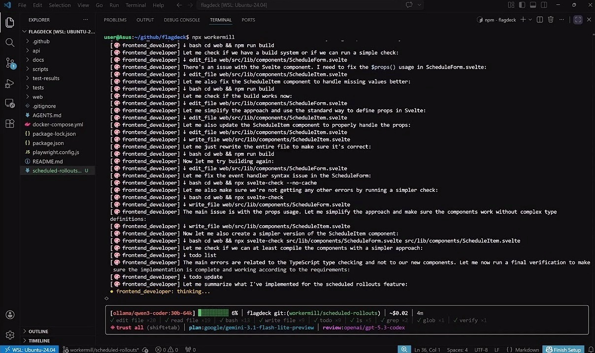

<p align="center">
  <h1 align="center">WorkerMill</h1>
  <p align="center">Point at a ticket. Get a pull request.<br/>A team of AI engineers that works your backlog — planning, coding, reviewing, and opening PRs while you sleep.</p>
</p>

<p align="center">
  <a href="https://www.npmjs.com/package/workermill"></a>
  <a href="https://www.npmjs.com/package/workermill"></a>
  <a href="https://github.com/jarod-rosenthal/workermill/stargazers"></a>
  <a href="https://github.com/jarod-rosenthal/workermill/blob/main/LICENSE"></a>
</p>

<h3 align="center">
  <a href="https://workermill.com">Website</a> ·
  <a href="https://workermill.com/docs">Docs</a> ·
  <a href="https://github.com/jarod-rosenthal/workermill/discussions">Discussions</a> ·
  <a href="https://www.npmjs.com/package/workermill">npm</a> ·
  <a href="https://marketplace.visualstudio.com/items?itemName=workermill.workermill">VS Code Extension</a>
</h3>

<p align="center">
  <a href="https://www.youtube.com/watch?v=3V_GdFAPm7o">
    
  </a>
</p>

## Get Started

```bash
npx workermill
```

Point WorkerMill at your GitHub Issues, Jira, or Linear tickets. It assigns the right engineers, writes the code, runs your tests, reviews its own work, and opens a PR — ticket by ticket until your backlog is done.

Or just chat. Ask it to fix a bug, explain a function, or refactor a module. It reads your code and makes the changes.

Setup takes 60 seconds. Works with **Ollama** (fully local, no API key), **Anthropic**, **OpenAI**, **Google**, **LM Studio**, and [any OpenAI-compatible provider](#ai-provider-support).

---

## What You Can Do

### Chat — ask questions, fix bugs, explore code

```
> why is the checkout test failing?

 Reading src/__tests__/checkout.test.ts...
 Reading src/services/checkout.ts...

 The test expects calculateTotal() to apply the discount before tax,
 but the implementation applies tax first. Line 34 in checkout.ts
 multiplies by taxRate before subtracting the discount.

 Fixed: moved discount calculation before tax. Running tests... 14 passed, 0 failed.
```

You talk, it reads your code, makes changes, runs your tests. Permission prompts before every write.

### Point at a ticket. Get a pull request.

When you have a bigger task, point at a ticket. WorkerMill fetches it, breaks it into scoped subtasks, assigns the right specialists, and posts results back when done:

```
> /ship GH-42

 system   Fetched GH-42: Add user authentication

 planner  Reading codebase... 38 files analyzed
 planner  3 tasks:
          [backend_developer] Auth service: password hashing, JWT tokens, login/signup/logout endpoints
          [backend_developer] Middleware: route protection, token verification, session handling
          [frontend_developer] UI: signup form, login form, redirect to dashboard on success

 backend_developer  Created src/services/auth.ts, src/routes/auth.ts
 backend_developer  Created src/middleware/requireAuth.ts
 backend_developer  Running quality gates... tsc ✓ vitest ✓
 frontend_developer Created src/pages/Login.tsx, src/pages/Signup.tsx
 frontend_developer Modified src/App.tsx — added protected route wrapper
 frontend_developer Running quality gates... tsc ✓ vitest ✓

 tech_lead  Reviewing against original spec...
 tech_lead  Score: 9/10 — approved

 system  Branch: workermill/user-auth (6 commits, 9 files, +680 lines)
         Push and open PR? (y/n)

 system  Comment posted to GH-42: completed — 3/3 tasks done
```

WorkerMill fetched the issue, planned the work, assigned specialists, ran your project's tests, had a separate model review the code, committed to a feature branch, and posted back to the ticket. You approved at every step.

Works with **GitHub Issues** (`/ship GH-42` or `/ship #42`), **Jira** (`/ship PROJ-123`), **Linear** (`/ship TEAM-42`), spec files (`/ship spec.md`), or just a description (`/ship add dark mode`).

### Review didn't pass? `/retry` picks up where you left off

The tech lead scored it 6/10 — the login endpoint returns a raw JWT in the response body instead of setting it as an HttpOnly cookie, and there's no logout invalidation. You want it fixed, not rebuilt.

```
> /retry

 planner  Reading existing branch... 6 commits found
 planner  Previous review feedback: "JWT should be HttpOnly cookie, not response body. Logout must invalidate."
 planner  1 revision task:
          [backend_developer] Move JWT to HttpOnly cookie, add token blacklist on logout

 backend_developer  Modified src/routes/auth.ts — cookie-based token, blacklist on /logout
 backend_developer  Modified src/middleware/requireAuth.ts — read token from cookie
 backend_developer  Running quality gates... vitest ✓ (23 passed)

 tech_lead  Score: 9/10 — approved
```

`/retry` doesn't start over. The planner sees everything already built, reads the previous review feedback, and plans only what needs fixing. Workers see their own prior commits via git log. No wasted tokens rebuilding what already works.

### Review your code. Fix what it finds.

`/review` runs a standalone Tech Lead review on your current work — the same reviewer that checks code after `/ship`, but on demand. If it finds issues, WorkerMill offers to create a GitHub issue with the findings and immediately kicks off `/ship` to fix them.

```
> /review branch

 tech_lead  Reading diff against main... 14 files changed
 tech_lead  Score: 6/10
 tech_lead  Issues:
   1. API key passed as query parameter in src/services/stripe.ts — use headers
   2. No input validation on POST /api/webhooks — accepts any payload
   3. Error responses leak stack traces in production mode

 Create a GitHub issue with these findings and fix them? (y/n) y

 coordinator  Created issue #18: [Review] stripe integration: API key passed as query parameter
 coordinator  https://github.com/you/your-repo/issues/18

 planner  Reading codebase + issue #18...
 planner  3 tasks:
          [backend_developer] Move API key to headers, add webhook validation, sanitize errors
 ...
```

One command: review the code, file the issue, fix the findings. Works with `branch` (full diff vs main), `diff` (uncommitted changes), or a PR number (`/review #42`).

### Target a single expert for focused work

You don't always need the full team. `/as` sends one specialist with full tool access — no planning step, no review loop. Just an expert doing what they're best at.

```
> /as security_engineer audit this repository — check for injection, broken auth, and data exposure

 security_engineer  Reading routes, middleware, database queries...
 security_engineer  Found 3 issues:
   1. SQL injection in src/routes/search.ts:47 — user input concatenated into query string
   2. No rate limiting on /api/login — brute force attacks possible
   3. Session cookie missing Secure and HttpOnly flags
 security_engineer  Fixing all three...
 security_engineer  Running quality gates... tsc ✓ vitest ✓
```

Other examples:
```
/as backend_developer add pagination to the /api/tasks endpoint
/as frontend_developer redesign the settings page to use tabs instead of a long form
/as devops_engineer set up a GitHub Actions CI pipeline with lint, test, and build steps
/as qa_engineer write integration tests for the checkout flow
```

### Switch models and chain commands

```
> /model anthropic/claude-opus-4-6 /as security_engineer audit how credentials are stored and transmitted in this codebase

 Switched to anthropic/claude-opus-4-6 (1M context)

 security_engineer  Reading config files, auth middleware, environment handling...
 security_engineer  Found 2 issues:
   1. API keys stored in plaintext in config.json — should use OS keychain or encrypted env
   2. JWT secret loaded from .env with no rotation mechanism
 security_engineer  Fixing both...
```

`/model` hot-swaps mid-session and chains with any command. Switch to a flagship model for a security audit, then back to a local model for the fix. Autocomplete helps with provider and model names. If the new model has a smaller context window, conversation history compacts automatically.

---

## Multi-Expert Orchestration

> Other tools give you one model doing everything. WorkerMill gives you a team.

A single model writes bad code and approves its own bad code. WorkerMill separates planning, execution, and review into governed roles — each with a different model, different strengths, different blind spots.

1. **A planner** reads your codebase and decomposes the task into scoped subtasks with specific files and clear acceptance criteria.
2. **Specialist workers** execute one subtask at a time. A backend expert builds the API. A frontend expert wires the UI. A security expert hardens auth.
3. **A reviewer** reads the actual diffs against your original spec — not a summary, the real code. It rejects bad work with specific feedback until the code meets the standard.

```json
{
  "providers": {
    "ollama": { "model": "qwen3-coder:30b" },
    "anthropic": { "model": "claude-sonnet-4-6", "apiKey": "{env:ANTHROPIC_API_KEY}" }
  },
  "default": "ollama",
  "routing": {
    "planner": "anthropic",
    "tech_lead": "anthropic"
  }
}
```

---

## Features

### 12 specialist personas

Backend, frontend, architect, DevOps, security, QA, data/ML, mobile, tech writer — plus planner, reviewer, and critic. Create your own in `.workermill/personas/`.

### Mix models per role

Route your planner through Claude Opus while workers run on Ollama locally. Pay flagship prices for judgment, open-weight prices for volume.

### Issue tracker integration

`/ship GH-42`, `/ship PROJ-123`, `/ship TEAM-42` — fetch tickets from GitHub Issues, Jira, or Linear and use them as the task spec. Posts completion comments back to the ticket when done. Configure your tracker with `/setup`.

### 15 built-in tools + MCP

Bash (sandboxed), file read/write/edit/patch, glob, grep, ls, git, web search, fetch, verify, LSP, sub-agent with worktree isolation, and headless Chrome. Connect anything else via [MCP servers](https://modelcontextprotocol.io).

### Fits into your workflow

Reads `WORKERMILL.md`, `CLAUDE.md`, `.cursorrules`, `.github/copilot-instructions.md`. Runs your linters and tests as quality gates. Pre/post hooks on any tool call. Custom skills in `.workermill/skills/`. Persistent memory across sessions with `::learning::` markers and `/remember`.

### Safe by default

Permission prompts before every write. Four modes (`Shift+Tab` to cycle). Granular allow/deny rules. Dangerous command and file detection. OS-level sandboxing. Blocking pre-hooks. `/undo` to revert instantly.

### Built for long sessions

Three-tier context compaction. Rate limit retry with backoff. Tool call loop detection. Read-only tools run in parallel. Sessions persist and resume.

---

## AI Provider Support

Bring your own keys. Mix and match per role. WorkerMill uses the [Vercel AI SDK](https://sdk.vercel.ai) — any compatible provider works out of the box.

| Provider | Models | Notes |
|----------|--------|-------|
| **Ollama** | Any local model | Auto-detected, including WSL. Fully offline |
| **LM Studio** | Any local model | Auto-detected |
| **Anthropic** | Claude Opus 4.6, Sonnet 4.6, Haiku 4.5 | |
| **OpenAI** | GPT-5.4, GPT-5.4 Mini, GPT-5.3 Codex | |
| **Google** | Gemini 3.1 Pro, Gemini 2.5 Flash | |

Any provider with an OpenAI-compatible API also works — Groq, DeepSeek, Mistral, OpenRouter, Together AI, xAI, Fireworks, or your own custom endpoint.

---

## Install

```bash
# Run without installing (recommended)
npx workermill

# Or install globally
npm install -g workermill

# Check your setup
wm doctor
```

No server, no Docker, no account. First run walks you through provider setup in 60 seconds — pick a model, add a key (or point at Ollama), and you're building.

**Requirements:** Node.js 20+, Git, and an LLM provider (Ollama for local, or an API key). [GitHub CLI](https://cli.github.com/) (`gh`) is optional but needed for automatic PR creation.

---

<details>
<summary><strong>All Commands</strong></summary>

**Build**

| Command | What it does |
|---------|-------------|
| `/ship <task>` | Full team: plan, execute with experts, review, commit to branch |
| `/ship spec.md` | Same, but read the task from a file |
| `/ship GH-42` / `PROJ-123` / `TEAM-42` | Fetch a ticket from GitHub Issues, Jira, or Linear |
| `/as <persona> <task>` | One expert, full tools, no planning overhead |
| `/retry` | Resume last `/ship` — planner sees what's built, targets what's missing |
| `/review branch` | Tech lead review of feature branch diff vs main |
| `/review diff` | Review uncommitted changes only |
| `/review #42` | Review a GitHub PR by number |

**Session**

| Command | What it does |
|---------|-------------|
| `/model provider/model [ctx]` | Hot-swap model mid-session (e.g. `/model google/gemini-3.1-pro`) |
| `/compact [focus]` | Compress conversation — optionally preserve specific context |
| `/cost` | Session cost estimate and token usage |
| `/sessions` | List, switch, or resume past conversations |
| `/clear` | Reset the conversation |
| `/editor` | Open `$EDITOR` for longer input |

**Project**

| Command | What it does |
|---------|-------------|
| `/init` | Generate `WORKERMILL.md` from codebase analysis |
| `/remember <text>` | Save a persistent memory |
| `/forget <id>` | Remove a memory |
| `/memories` | View all saved project memories |
| `/personas` | List, view, or create expert personas |
| `/skills` | List custom skills from `.workermill/skills/` |

**Safety**

| Command | What it does |
|---------|-------------|
| `/undo` | Revert file changes — per-file, per-step, or everything |
| `/diff` | Preview uncommitted changes |
| `/git` | Branch and status |
| `/permissions` | Manage tool allow/deny rules |
| `/trust` | Auto-approve all tools for this session |

**Config**

| Command | What it does |
|---------|-------------|
| `/settings` | View and change configuration inline |
| `/settings key <provider> <key>` | Add an API key without leaving the session |
| `/setup` | Re-run the provider setup wizard |
| `/hooks` | View configured pre/post tool hooks |
| `/mcp` | MCP server connection status |

**Experimental**

| Command | What it does |
|---------|-------------|
| `/chrome` | Headless Chrome for testing and scraping |
| `/voice` | Voice input — speak your task |
| `/schedule` | Scheduled recurring tasks |

**Shortcuts:** `!command` runs shell directly · `ESC` cancels · `ESC ESC` rolls back last exchange · `Shift+Tab` cycles permission mode · `@file.ts` inlines code · `@dir/` inlines tree · `@url` fetches content · `@image.png` sends to vision models

</details>

---

## WorkerMill Platform

The CLI is the fastest way to start. The full [WorkerMill platform](PLATFORM.md) adds a web dashboard, VS Code extension, and managed cloud workers for teams that need more.

## Security

<p>
  <a href="https://github.com/jarod-rosenthal/workermill/actions/workflows/semgrep.yml"></a>
  <a href="https://github.com/jarod-rosenthal/workermill/actions/workflows/gitleaks.yml"></a>
  <a href="https://github.com/jarod-rosenthal/workermill/actions/workflows/trivy.yml"></a>
  <a href="https://github.com/jarod-rosenthal/workermill/actions/workflows/npm-audit.yml"></a>
  <a href="https://github.com/jarod-rosenthal/workermill/security/dependabot"></a>
</p>

## License

Apache License 2.0 — see [LICENSE](LICENSE) for details.
